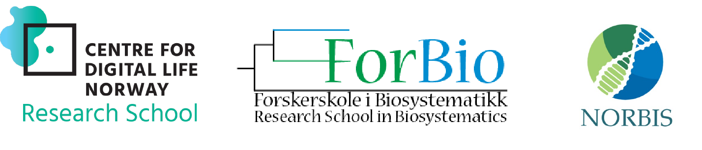

# Bioinformatics for Environmental Sequencing (DNA metabarcoding)
#### BIO9905MERG1 Spring 2021

### UNDER CONSTRUCTION

## Course content
For mapping and exploring communities of both micro- and macroorganisms, high throughput sequencing (HTS) of environmental DNA has become a powerful approach. One can either analyze the total DNA content to obtain knowledge about which genes are present (DNA metagenomics) or sequence a selected PCR amplified marker (DNA metabarcoding) to obtain information about the taxonomic composition. We will focus on the latter approach in this course. The students will be introduced to important analytical bioinformatics approaches from processing of raw sequence data to establishment of the OTU/sample matrix and retrieval of taxonomic identity of the sequences.

Important themes will be (1) filtering and quality assessment of high throughput sequence data, (2) error correction and/or clustering of high throughput sequence data, and (3) taxonomic annotation of high throughput sequence data. We will also touch upon some further downstream analyses, including network analyses and evolutionary placement of HTS onto backbone phylogenies. Applications of a wide suite of tools will be presented, including VSEARCH and DADA2.

The course will be a blend of presentations, guest lectures, discussion and a few hands on sessions. All hands-on secession will be run in R on your local laptop/computer. Hence, all participants should have R and selected R packages installed – see information below. (Due to the covid situation, we do not have the capacity to run analyses on servers – as we usually do).

## Schedule

The course will run 3-7 May 9am-4(5)pm in zoom. For a detailed overview of the program, see below. The zoom link will be provided.

## Report
Those of you that attend the course through the research schools or UiO and want to obtain ECT credits, will have to hand in a short report a few weeks after the course. You should here write about how you would carry out a fictional environmental sequencing study. We will provide more information about this.

## Teachers
Main teachers will be Ramiro Logares, Anders K.  Krabberød, Micah Dunthorn, Torbjørn Rognes and Håvard Kauserud (organizer), but other experts will provide guest lectures (see table).

## Program

| Day          | Time (start) | Topic                                                   | Responsible                          |
| ------------ | ------------ | ------------------------------------------------------- | ------------------------------------ |
| **Monday**   | 09:00        | Introduction to DNA metabarcoding                       | Håvard Kauserud                      |
|              | 10:00        | Introduction to sequencing techniques                   | Robert Lyle                          |
|              | 11:00        | Discussion groups: Get to know each other               | Håvard Kauserud                      |
|              | 12:00        | _Lunch break_                                           |                                      |
|              | 12:45        | Introduction to Linux and R/Rstudio                     | Ramiro Logares/Anders K. Krabberød   |
|              | 14:00        | Introduction to cutadapt and sequence cleaning          | Ramiro Logares                       |
|              | 15:00        | Introduction to VSEARCH (and SWARM)                     | Torbjørn Rognes                      |
|              | 16:00        | [Help with setup of required packages for DADA2](Setup) | Anders K. Krabberød                  |
| **Tuesday**  | 09:00        | [Introduction to DADA2](Dada2_Pipeline)                 | Anders K. Krabberød                  |
|              | 10:00        | [Continuation DADA2](Dada2_Pipeline)                    | Anders K. Krabberød                  |
|              | 11:00        | [Continuation DADA2](Dada2_Pipeline)                    | Anders K. Krabberød                  |
|              | 12:00        | _Lunch break_                                           |                                      |
|              | 12:45        | Contamination issues during DNA metabarcoding           | Kristine Bohmann                     |
|              | 14:00        | [Continuation DADA2](Dada2_Pipeline)         | Ramiro Logares / Anders K. Krabberød |
|              | 15:00        | Diet analyses                                           | Galina Gusarova                      |
| **Wednesday** | 09:00        | Taxonomic assignment                                    | Marie Davey                          |
|              | 10:00        | Discussion groups                                       | Håvard Kauserud and others           |
|              | 11:00        | Flexible time                                           |                                      |
|              | 12:00        | _Lunch break_                                           |                                      |
|              | 12:45        | Multivariate analyses of DNA-metabarcoding data         | Ramiro Logares                       |
|              | 14:00        | Multivariate analyses of DNA-metabarcoding data         | Ramiro Logares                       |
|              | 15:00        | In-silico PCR and how to get quantitative information   | Douglas Yu                           |
| **Thursday** | 09:00        | Phylogenetic placement of HTS data                      | Micah Dunthorn                       |
|              | 10:00        | Phylogenetic placement of HTS data                      | Micah Dunthorn                       |
|              | 11:00        | OTUs, ASVs and phylospecies                             | Micah Dunthorn                       |
|              | 12:00        | _Lunch break_                                           |                                      |
|              | 12:45        | Long-read metabarcoding                                 | Mahwash Jamy                         |
|              | 14:00        | Introduction to metacoder                               | Ella Thoen                           |
|              | 15:00        | Case study                                              | Sundy Maurice                        |
| **Friday**   | 09:00        | [Network analyses of DNA-metarcoding data](Networks)    | Anders K. Krabberød                  |
|              | 10:00        | [Network analyses of DNA-metarcoding data](Networks)    | Anders K. Krabberød                  |
|              | 11:00        | Methods to retrieve intra-species diversity information | Owen S. Wangensteen Fuentes          |
|              | 12:00        | _Lunch break_                                           |                                      |
|              | 12:45        | Flexible time                                           |                                      |
|              | 14:00        | Discussion groups                                       | Håvard Kauserud                      |
|              | 15:00        | DNA-metabarcoding - where are we going?                 | Pierre Taberlet                      |

---
# Software
We will use R (version 4.0.5 or later) and Rstudio (version 1.4.1 or later) in this course.

**Everybody should download and install R (https://www.r-project.org/), Rstudio (https://www.rstudio.com/) and the required packages before the course starts**.

For more information about required packages [Click here](Setup/).

---

# Suggested reading (reviews)
You can find the PDFs [here:](Suggested_reading/)
- Zinger et al. 2019. DNA metabarcoding—Need for robust experimental designs to draw sound ecological conclusions. Molecular Ecology, 28, 1857-1862
- Deiner et al. 2017. Environmental DNA metabarcoding: Transforming how we survey animal and plant communities. Molecular Ecology, 26, 5872-5895.
- Bohmann et al. 2014. Environmental DNA for wildlife biology and biodiversity monitoring. TREE, 29.
- Alberdi et al. 2017. Scrutinizing key steps for reliable metabarcoding of environmental samples. Methods in Ecology and Evolution, 9, 134-147.
- Ficetola et al. 2016. How to limit false positives in environmental DNA and metabarcoding? Molecular Ecology, 16, 604-607.
- Dickie et al. 2018. Towards robust and repeatable sampling methods ineDNA-based studies. Molecular Ecology Resources, 18, 940-952.
- Schnell et al. 2015. Tag jumps illuminated – reducing sequence‐to‐sample misidentifications in metabarcoding studies. Molecular Ecology Resources, 15, 1289-1303.Antich et al. 2021. To denoise or to cluster, that is not the question: optimizing pipelines for COI metabarcoding and metaphylogeography. BMC Bioinformatics, 22,177.
- Lamb et al. 2019. How quantitative is metabarcoding: A meta‐analytical approach. Molecular Ecology, 28, 420-430.
 -Jamy et al. 2019. Long-read metabarcoding of the eukaryotic rDNA operon to phylogenetically and taxonomically resolve environmental diversity. Molecular Ecology Resources, 20, 429-443.
 ----
### Supported by [Digitalt Liv Norge](https://www.digitallifenorway.org/), [ForBio](https://www.forbio.uio.no/), and [Norbis](https://norbis.w.uib.no/)

---

---
##### Proud supporters of Superman, Super Mario, and the Super League  
---
